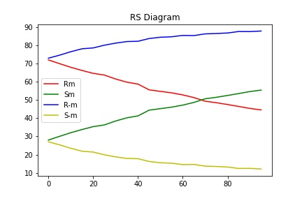
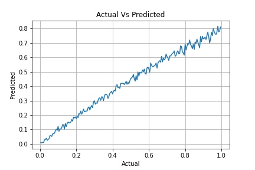
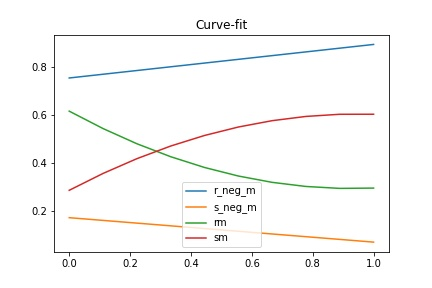

### Installation Instructions

```
pip install -r requirements.txt
```

### Run instructions

The utility functions are written in ```util.py``` and the required functions are imported into the ```Project.ipynb```. Executing the ```Project.ipynb``` cell-by-cell shall the fetch the results.

## RS Diagram
>

## Actual Vs Predicted percentage of p
>

## Curve Fitting the RS Diagram
>